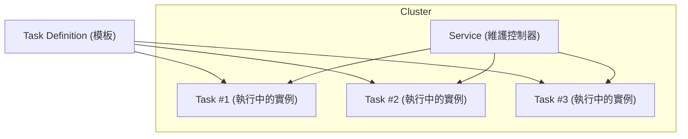

# ECS Demo Project with Terraform

這是一個使用 Terraform 部署到 AWS ECS Fargate 的 Demo 專案，包含兩個微服務：`hello-service` 與 `world-service`。

## 架構說明

- **Infrastructure**: Terraform
- **Container Orchestration**: AWS ECS (Fargate)
- **Load Balancer**: Application Load Balancer (ALB)
- **Service Discovery**: AWS Cloud Map (Service Connect)
- **Observability**: OpenTelemetry (ADOT) + AWS X-Ray

## 服務介紹

1.  **Hello Service**:
    -   Port: 5000
    -   功能：回傳 "hello" 字串，並透過 HTTP 呼叫 World Service。
2.  **World Service**:
    -   Port: 5001
    -   功能：回傳 "world" 字串，並透過 HTTP 呼叫 Hello Service。

## 部署流程

### 1. 先決條件
- 安裝 [Terraform](https://www.terraform.io/)
- 安裝 [Docker](https://www.docker.com/)
- 設定 AWS Credentials (`~/.aws/credentials`)

### 2. 初始化 Terraform
```bash
terraform init
```

### 3. 部署
```bash
terraform apply
```
部署過程中會自動：
1. 建立 ECR Repository
2. Build Docker Images (`hello` & `world`)
3. Push Images 到 ECR
4. 建立 VPC, ALB, ECS Service 等基礎設施

### 4. 測試
部署完成後，Terraform 會輸出 ALB 的 URL：
```
Outputs:
hello-service-url = "http://tf-demo-xxxx.ap-northeast-1.elb.amazonaws.com:8080"
world-service-url = "http://tf-demo-xxxx.ap-northeast-1.elb.amazonaws.com:8081"
```

呼叫 Hello Service 測試 (它會去叫 World Service)：
```bash
curl http://<ALB_DNS>:8080/test
# 預期回傳: "hello world"
```

## Trace (Observability)

本專案使用 **Sidecar 模式** 整合 **AWS Distro for OpenTelemetry (ADOT)** 與 **AWS X-Ray**。

### 實作細節

1.  **Application (Python Flask)**:
    -   使用 `opentelemetry-python` SDK。
    -   設定 `AwsXRayIdGenerator` 以相容 X-Ray Trace ID 格式。
    -   將 Traces 送往 `http://localhost:4317` (gRPC)。

2.  **Infrastructure (Terraform)**:
    -   **IAM Roles**:
        -   `ecsTaskRole`: 賦予 App 寫入 X-Ray 的權限 (`AWSXrayWriteOnlyAccess`)。
    -   **Task Definition**:
        -   在 `container_definitions` 中加入 **ADOT Collector Sidecar** (`public.ecr.aws/aws-observability/aws-otel-collector:latest`)。
        -   Sidecar 使用預設設定 (`--config=/etc/ecs/ecs-default-config.yaml`)，負責接收 OTLP 數據並轉發至 AWS X-Ray。
    -   **Log Group**:
        -   建立 CloudWatch Log Group `/ecs/ecs-aws-otel-sidecar-collector` 供 Sidecar 紀錄運作日誌。

### 查看 Trace
前往 [AWS Console CloudWatch Service Map](https://console.aws.amazon.com/cloudwatch/home?region=ap-northeast-1#xray:service-map) 即可看到服務間的呼叫關聯與效能數據。

## 清除資源
```bash
terraform destroy
```
*注意：`ecsTaskExecutionRole` 若為外部 Import 的資源，Destroy 時不會被刪除，僅會移除 Policy Attachment。*

## ECS 元件


